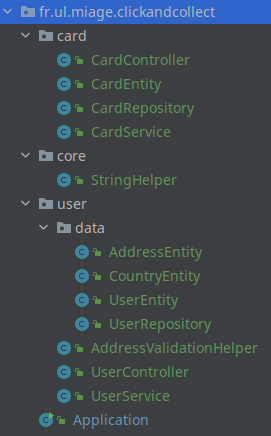

# Feature based architecture

> This is a code architecture - way of organizing your code.
>
> Organizing your code in a meaningful manner helps when you want to
> maintain, extract parts of it, create libs, test, define the visibility.

In a feature based architecture you group files in __packages__ by their __BUSINESS__ meaning.

This can be useful when you are building monoliths, apps that are doing multiple things.
One monolith can do multiple jobs in one single domain, as well can do multiple jobs for multiple domains.
It all depends on how big it. 

There are developers who are using __layer based architecture__ even in monoliths. This is far from being optimal
as each and every __packages__ has lots of classes and when you think about developing a feature, you need to pay 
attention of what class you change as it might impact multiple features at once.

> The bigger the monolith is - the harder is to maintain it.

Examples:
- manage the users.
- __AND__ their image galleries.
- __AND__ the uploaded files.
- __AND__ a basket for this e-commerce website that sells images (_like https://www.shutterstock.com_).

Here's a list of commonly used packages and examples of files names inside:

- __user__ - UserController, UserService, UserRepository, UserEntity.java, AddressEntity, CountryEntity, AddressValidationHelper
- __card__ - CardController, CardService, CardRepository, CardEntity

If one of the feature packages becomes large, you can always start using the layered based architecture within the feature package.
At some point you'll start to think that it can be a good idea to extract this particular feature into a dedicated microservice.
Or an application that runs on its own.

In some cases you might need some kind of __core__ package that hase the common functionality. 
Generally speaking it is a good idea to extract this to a external library. Or create the needed function next to the actual usage.

- __core__ - StringHelper

Here's a visual example:

