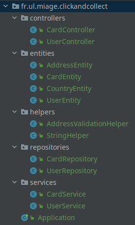

# Layer based architecture

> This is a code architecture - way of organizing your code.
> 
> Organizing your code in a meaningful manner helps when you want to 
> maintain, extract parts of it, create libs, test, define the visibility.

In a layer based architecture you group files in __packages__ by their __TECHNICAL__ meaning.

This can be useful when you are building __microservices__. 
One microservice is supposed to do one job in one single domain.

Examples: 
 - manage the users.
   - _CRUD for a list of users._
 - image gallery.
   - _manages the albums and their information._
   - _have references to the actual files from another microservice._
 - file service.
   - _CRUD for a list of files and their metadata._
 - basket for a e-commerce website.

Therefore, we are expected to have only one feature that is to be covered by the code of the µs in question.

Here's a list of commonly used packages and examples of files names inside:

- __controllers__ - UserController, CardController
- __services__ - UserService, CardService
- __repositories__ - UserRepository, CardRepository
- __entities__ - UserEntity.java, AddressEntity, CountryEntity, CardEntity
- __helpers__ - AddressValidationHelper, StringHelper

Here's a visual example:

